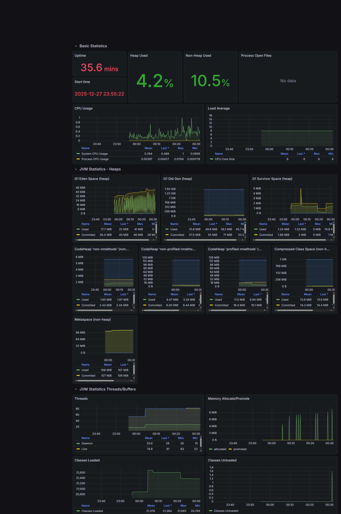

# Sentinel: High-Concurrency Distributed Ticketing Engine

Sentinel is a production-grade backend engine engineered to solve the "Flash Sale" problem: maintaining 100% data consistency and high availability during extreme traffic spikes (e.g., concert ticket launches).

## 🚀 The Challenge
During high-demand events, thousands of users attempt to reserve the same resource at the exact same millisecond. A standard monolithic or CRUD-based application typically suffers from:
* **Race Conditions:** Over-selling inventory due to concurrent database writes.
* **Connection Pool Exhaustion:** Database connections held "hostage" by slow external I/O.
* **Thread Starvation:** Traditional thread-per-request models hitting RAM limits.

Sentinel addresses these through a multi-layered distributed architecture and modern Java 21 concurrency primitives.

## 🛠 Tech Stack
* **Language:** Java 21 (utilizing **Virtual Threads** for high-throughput I/O).
* **Framework:** Spring Boot 3.4 (LTS).
* **Distributed Locking:** **Redisson (Redis)** for atomic "Check-and-Reserve" operations.
* **Database:** PostgreSQL with **JPA Optimistic Locking** as a secondary fail-safe.
* **Messaging:** **Apache Kafka** for asynchronous, non-blocking event streaming.
* **Observability:** Prometheus & Grafana (via Spring Boot Actuator & Micrometer).
* **Infrastructure:** Fully containerized with Docker Compose.

## 🏗 Key Technical Implementations

### 1. Distributed Locking & Fail-Fast Semantics
To prevent double-booking across multiple horizontally scaled server instances, I implemented a distributed lock using Redisson. The system follows a **fail-fast** pattern: if a resource is already locked, the request immediately returns an **HTTP 409 Conflict**, preventing thread hanging and maximizing system responsiveness.

### 2. Transaction Boundary Optimization
A critical architectural decision was made to decouple **Apache Kafka** event emission from the database `@Transactional` block. This prevents database connections from being held open while waiting for the message broker, effectively eliminating HikariCP connection pool exhaustion during network latency spikes.

### 3. Java 21 Virtual Threads (Project Loom)
The engine is configured to utilize Virtual Threads. This allows the application to handle a massive number of concurrent HTTP connections with minimal memory overhead, significantly outperforming traditional thread-pool models under high-concurrency load.

## 📊 Performance & Load Testing
The system's integrity was validated using a custom Bash-based stress-test suite.

* **Scenario:** 50 concurrent users attempting to reserve the **exact same seat** at the same millisecond.
* **Result:**
    * **Success Rate:** Exactly 1 successful reservation (`201 Created`).
    * **Conflict Handling:** 49 rejected attempts (`409 Conflict`).
    * **Data Integrity:** 100% consistency; Database version incremented exactly once.

## 📈 Monitoring & Observability

The application is fully instrumented for production monitoring. Real-time metrics are scraped by **Prometheus** and visualized in **Grafana**.



* **JVM Metrics:** Virtual Thread states and Garbage Collection overhead.
* **Database Health:** SentinelHikariPool active/idle connection tracking.
* **Infrastructure:** Real-time CPU and Memory utilization spikes during stress tests.

## 🚦 Getting Started

### Prerequisites
* Docker & Docker Desktop
* JDK 21+

### Installation & Execution

1. **Clone the repository:**
   ```bash
   git clone https://github.com/Smile-Khan/sentinel-ticketing-engine.git
   cd sentinel-ticketing-engine
Start Infrastructure (PostgreSQL, Redis, Kafka, Prometheus, Grafana):
code
Bash
docker-compose up -d
Run the Application:
code
Bash
mvn clean spring-boot:run
Verify the Observability Stack:
Grafana: http://localhost:3000 (Login: admin / admin)
Prometheus: http://localhost:9090
Metrics Endpoint: http://localhost:8080/actuator/prometheus
Run the Concurrency Stress Test:
code
Bash
chmod +x stress-test.sh
./stress-test.sh
Developed with a focus on Distributed Systems Design, Resiliency, and Technical Excellence.